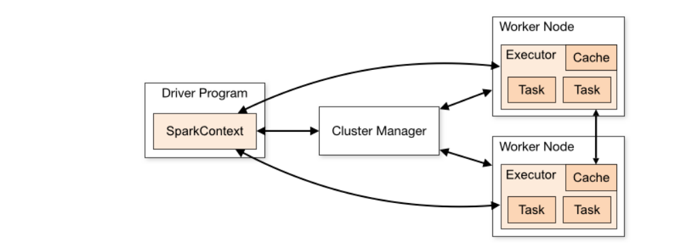
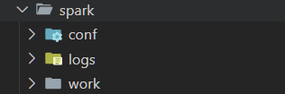

# Setting up a multi-node standalone Apache Spark cluster on Hyak

## Architecture of Spark cluster

The Apache Spark cluster is largely made up of two parts, the **master** nodes and the **worker** nodes. The cluster master is the brain of the cluster and makes sure each worker is doing what it is supposed to while the worker node receive work from the master and executes the task, returning the completed work back to the master. Once this cluster is running, we can submit jobs to the master and the master will automatically split the job into smaller parts that can be processed by the workers.

In this tutorial, we will quickly learn about how to work with Hyak, the UW compute cluster, and other common linux tools such as Tmux. Then we will learn about Apptainer / Singularity container and create our own Apptainer container with spark installed. And then finally, we will then configure the necessary parameters for Apache Spark and run a simple recordlinkage program using the Splink package.

## Tools and Setup

I will assume that everyone has access to Hyak. Otherwise, see [this](https://hyak.uw.edu/docs/account-creation). Once you have logged in, you can use `hyakalloc` to see the current resources available to you. If you have access to other research labs, you are welcome to use them but I will use the `STF` account since everyone has access to those.

The partitions we should take close attention to are the `compute` and `compute-hugemem`. Make sure the partition you are requesting resources from are not full as you will be in queue until the resource gets freed. While users have various restrictions on the amount of resources they can request at once interactively, the most important factor in our usecase is the total memory allocation which has a hard limit of 175G.

To gain allocation, use the `salloc` command like this, `salloc -A stf -p \<partition\> --time=DD-HH:MM:SS --mem=\<amount\> -N=1` where partition is either `compute` or `compute-hugemem`. A functioning command will be `salloc -A stf -p compute --time=1:00:00 --mem=50G -N 1` This command will grand you 1 node with 175G of memory for the specified time on the specified partition under the stf account. You can read more about salloc [here](https://slurm.schedmd.com/salloc.html).

Once you are placed in a node, you can do `whoami` to see your username and using that do `squeue -u \<username\>` to see your current session. After you have confirmed that everything is working, create the Intercluster SSH Keys by following the instructions [here](https://hyak.uw.edu/docs/setup/intracluster-keys). This will allow the spark master to talk to the workers since they will be all on different nodes.

Finally, we will be using `tmux` which is pre-installed on Hyak to keep the entire cluster running since closing the tab wit the cluster master will break the spark cluster. You can read more about tmux [here](https://www.howtogeek.com/671422/how-to-use-tmux-on-linux-and-why-its-better-than-screen/)

## Apptainer

Setting up a spark cluster on a HPC environment is a bit more challanging because you share the overall environment with other users. To overcome this challange and to setup a clean environment with reproducability and portability in mind, we make use of Apptainer.

### What is Apptainer container?

In simple terms, Apptainer is Docker for HPC. To build a Docker container, you need root privileges which on a HPC environment is not ideal with so many people using the same cluster. Apptainer solves this by allowing you to build images even when you don't have root privileges. There are many ways to build an Apptainer image but we will first create a definition file and then create a image file from that.

### Definition file

The included `spark.def` file is the definition file we will be using to build our image. It downloads the necessary package and programs to run the spark cluster. After you have node allocation, run `apptainer build <destination>.sif <source>.def` to start building our container. In our case it would be `apptainer build spark.sif spark.def`. This will create a container in the current directory named `spark.sif` from the definition file `spark.def`. After the image is created you can execute commands from the container by doing `apptainer exec spark.sif <command>`. For example, to run a python command, you would do `apptainer exec spark.sif python3 test.py`. Another way to use Apptainer is to enter the shell. `apptainer shell spark.sif` will place you inside a container shell. There are many options you can use which you can read more about [here](https://apptainer.org/docs/user/main/cli/apptainer_shell.html) but the only option we will be using is `bind` option. The bind option allows the Apptainer to bind directories from outside the container to insdie the container. For example, if you enter the Apptainer shell without any binds and try to go to `/gscratch` you will see that nothing is there. `apptainer shell --bind /gscratch:/gscratch spark.sif` will allow you to see /gscratch directory from inside the container. You are free to use the container as you wish from here. To get our of the shell just do `exit`.

## Creating Spark directory

Now that we have the basic components ready, we need to create a spark directory to store our spark config, log, and work. During spark runtime, spark regularly writes to `spark/conf`, `spark/log`, and `spark/work`. However, Apptainer image is not normally writable and so we have to make those paths in a writable directory.

To make sure everything is binded correctly we have to use this command to enter our shell. `apptainer shell --bind /gscratch:/gscratch,./spark/conf:/spark/spark-3.5.1-bin-hadoop3/conf,./spark/logs:/spark/spark-3.5.1-bin-hadoop3/logs,./spark/work:/spark/spark-3.5.1-bin-hadoop3/work spark.sif`. Bind command take the form of `path_outside:path_inside` with multiple binds separated by a comma without space.

One more thing we have to do is to modify a file called `spark-env.sh` inside the `spark/conf`. This file allows you to set the environment variables for spark. A full list of environment variables you can set can be seen [here](https://spark.apache.org/docs/latest/spark-standalone.html). For our case, we want to set couple variables. `SPARK_MASTER_HOST` is the name of the node you currently have allocation for (n3302, n3384, g2234, z3342, etc) so change the master host to what you currently have allocated. `SPARK_WORKER_CORES` is the number of cores you want the worker node to use. It will default to 1 if not set. `SPARK_WORKER_MEMORY` is the amount of memory you want each worker to use. It will default to 1GB on hyak if not set.

## Running Spark

We can now finally start running the spark cluster! After allocating a node on Hyak using `salloc -A stf -p compute --time=1:00:00 --mem=50G -N 1`, start a tmux shell by `tmux`. Once you are inside tmux shell, start the Apptainer shell by doing `apptainer shell --bind /gscratch:/gscratch,./spark/conf:/spark/spark-3.5.1-bin-hadoop3/conf,./spark/logs:/spark/spark-3.5.1-bin-hadoop3/logs,./spark/work:/spark/spark-3.5.1-bin-hadoop3/work spark.sif`. This will place you inside Apptainer and once you are inside, run the start-master script by doing`/spark/spark-3.5.1-bin-hadoop3/sbin/start-master.sh`. Once the start script is done running, you can check if the Spark master is actually running by going into `/spark/logs` in the home directory and looking at the log file called `EDIT THIS`. If it looks somewhat like the one provided, congrats! spark cluster is up and running.

One thing you should be careful about is that the spark cluster will be deallocated once you exit the terminal which you setup the master. The worker node will also be lost if you close the terminal which you setup the worker. This is the reason we use tmux, since you can push terminal to the background wihtout closing them.

## Multi-node Spark cluster

Now we will learn about to connect multiple worker nodes to the master and make a more realistic spark cluster. First off, we should deallocate everything and start fresh since in our current configuration, we only asked for 1 node and we need multiple nodes for the master and the workers. Do `exit` until you are back at the hyak login nodes. Before we start, a good idea is to delete the logs in the `spark/conf/logs` directory since spark natively does not clear the logs and it becomes hard to debug later if there are logs from previous spark sessions.

Now we want to ask for at least 3 nodes (1 master, 1 worker, 1 free node to submit spark jobs) so we will use `salloc -A stf -p compute --time=3:00:00 --mem=100G -N 3` to get 3 nodes for 3 hours with total memory of 100G. Once you get your allocation, you can either do `squeue -u <netid>` or `srun hostname` to get the list of nodes you got. For example `n[2000-2003]` means you have the nodes `n2000, n2001, n2002, n2003`. From here, start a tmux session, ssh into the first node if you are not in one already, start apptainer shell with the binds mentioned above, go into `/spark/conf/spark-env.sh` and change the master host to the current node, and run the `/spark/spark-3.5.1-bin-hadoop3/sbin/start-master.sh` command and check the logs direcory to see if spark master started up correctly. In the master logs file there should be a line that looks something like `24/05/16 21:07:55 INFO Master: Starting Spark master at spark://n3385:7077`. `spark://n3385:7077` is the address of the spark master and remember this when you start the worker. Now do `ctrl + b` and `d` to exit the tmux session and do `tmux` again in the terminal to create a new session. In this session, ssh into a node not running the spark master and this time all you have to do is start apptainer shell and start the worker using `/spark/spark-3.5.1-bin-hadoop3/sbin/start-master.sh <master address>`. In my case it would be `/spark/spark-3.5.1-bin-hadoop3/sbin/start-master.sh spark://n3385:7077`. This will connect the worker to the master and you can check if this was successful by going into the master log file in the logs and seeing the log that says worker connected.

## Additional Reading

* [What is RecordLinkage](https://www.ncbi.nlm.nih.gov/pmc/articles/PMC5005943/#:~:text=For%20example%2C%20in%20a%20longitudinal,possibly%20non%2Dunique%2C%20keys.)
* [Splink docs](https://moj-analytical-services.github.io/splink/index.html)
* [Official Standalone Spark Docs](https://spark.apache.org/docs/latest/spark-standalone.html)
* [Deep dive into Spark architecture](https://medium.com/@amitjoshi7/spark-architecture-a-deep-dive-2480ef45f0be#:~:text=Cluster%20mode%20is%20probably%20the,addition%20to%20the%20executor%20processes.)
* [Advanced resource allocation guide](https://medium.com/@badwaik.ojas/spark-cluster-creation-things-to-consider-cf0cb9f33f1c)

## Future Projects

Set up (salloc, tmux, )

apptainer (def, sif files, building, )
